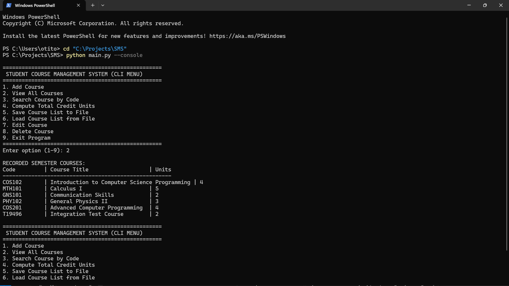

# 1. GitHub Repository Link
**GitHub Repository URL**: ***(https://github.com/Razznik99/School-Course-Management-System.git)***

---

# 2. Project Overview (What the System Does)

The **Student Course Management System (SCMS)** is a desktop-friendly, dual-interface application designed to streamline academic course registration, record-keeping, and credit unit tracking for a student's semester. It was built using Python 3.12+ (standard library only) for the backend processing and SQLite3 for local persistent storage, paired with a modern HTML5/CSS3/JavaScript client dashboard for the user interface.

### Key Capabilities:
- **Dual Interfaces**: Runs natively as a sleek, modern **Web Dashboard GUI** (featuring Glassmorphic UI designs, active counts, and responsive layouts) or as an interactive **Console CLI Menu**.
- **Course Administration**: Allows adding, viewing, editing, and deleting course records containing unique *Course Codes*, *Course Titles*, and *Credit Units*.
- **Algorithmic Computations**: Employs **recursive array traversal** to compute the sum total of course credit units and to execute case-insensitive substring searches across codes and titles.
- **State Synchronization**: Keeps in-memory arrays synchronized with a local SQLite database (`courses.db`) and supports exporting/importing to and from standardized JSON storage files.

---

# 3. System Architecture & Feature Walkthrough

The system follows an Object-Oriented model, dividing concerns between the Data Model (`Course`), the Controller (`CourseManager`), the Network Handler (`CourseHTTPRequestHandler`), and the Frontend interface.

### A. Core Data Modeling (`Course` Class)
The `Course` class encapsulates validation rules, ensuring data integrity:
- **Course Code**: Normalized to uppercase, trimmed, and checked for empty values.
- **Course Title**: Trimmed and validated to be non-empty.
- **Credit Units**: Validated to be positive integers greater than zero.

```python
class Course:
    def __init__(self, course_code, course_title, unit):
        self.course_code = str(course_code).strip().upper()
        self.course_title = str(course_title).strip()
        
        try:
            self.unit = int(unit)
        except (ValueError, TypeError):
            raise ValueError("Course unit must be a valid integer.")
        
        if not self.course_code:
            raise ValueError("Course code cannot be empty.")
        if not self.course_title:
            raise ValueError("Course title cannot be empty.")
        if self.unit <= 0:
            raise ValueError("Course unit must be a positive integer greater than zero.")
```

### B. Recursive Course Search
Rather than using standard loop structures, the system implements search using **array recursion**. The search matches any case-insensitive substring of the *Course Code* or the *Course Title*.

```python
def search_courses(self, query):
    return self._recursive_search(self.courses, query.strip().upper(), 0)

def _recursive_search(self, course_list, query, index):
    # Base Case: Reached the end of the array, return empty list
    if index >= len(course_list):
        return []
    
    # Substring & case-insensitive match checks
    code_match = query in course_list[index].course_code
    title_match = query in course_list[index].course_title.upper()
    
    # Recursive Case: Get matches from the rest of the array
    matches_from_rest = self._recursive_search(course_list, query, index + 1)
    
    # Prepend matching course to the accumulator list
    if code_match or title_match:
        return [course_list[index]] + matches_from_rest
    else:
        return matches_from_rest
```

### C. Recursive Credit Summation
To display the total credit load of a semester, the system recursively accumulates course units:

```python
def compute_total_units(self):
    return self._recursive_sum_units(self.courses, 0)

def _recursive_sum_units(self, course_list, index):
    # Base Case: Reached the end of the array
    if index >= len(course_list):
        return 0
    
    # Recursive Case: Accumulate current units + remaining units
    return course_list[index].unit + self._recursive_sum_units(course_list, index + 1)
```

### D. Edit and Delete Course Operations (Student Added)
The backend leverages SQLite SQL commands `UPDATE` and `DELETE` to manage course mutations, which then automatically reload into memory to maintain consistency:

```python
def edit_course(self, old_course_code, new_course_code, new_title, new_unit):
    # ... Validation rules ...
    connection = sqlite3.connect(self.db_path)
    cursor = connection.cursor()
    cursor.execute(
        "UPDATE courses SET course_code = ?, course_title = ?, unit = ? WHERE course_code = ?",
        (new_course_code, new_title, new_unit, old_course_code)
    )
    connection.commit()
    connection.close()
    self.load_from_db() # Reload database states into active memory

def delete_course(self, course_code):
    connection = sqlite3.connect(self.db_path)
    cursor = connection.cursor()
    cursor.execute("DELETE FROM courses WHERE course_code = ?", (course_code,))
    connection.commit()
    connection.close()
    self.load_from_db()
```

### E. File Persistence & Serialization
The course catalog can be written to disk in a structured JSON text format and loaded back to populate the SQLite database.

```python
def save_to_file(self, filename="courses.json"):
    data_list = [c.to_dict() for c in self.courses]
    with open(filename, "w", encoding="utf-8") as f:
        json.dump(data_list, f, indent=4)

def load_from_file(self, filename="courses.json"):
    with open(filename, "r", encoding="utf-8") as f:
        data_list = json.load(f)
    
    connection = sqlite3.connect(self.db_path)
    cursor = connection.cursor()
    for item in data_list:
        course = Course(item.get("course_code"), item.get("course_title"), item.get("unit"))
        cursor.execute(
            "INSERT OR REPLACE INTO courses (course_code, course_title, unit) VALUES (?, ?, ?)",
            (course.course_code, course.course_title, course.unit)
        )
    connection.commit()
    connection.close()
    self.load_from_db()
```

---

# 4. Program Execution (Running Screenshots)

The screenshots below verify the program running in both interfaces and demonstrating all required behaviors.

### A. Web Dashboard GUI - Main Registry Screen
This screenshot shows the Web interface listing registered courses, calculating total credits, and providing the forms for course registration and file saving/loading.

.png)

### B. Web Dashboard GUI - Search and Modification Features
This screenshot illustrates searching courses using substring queries (e.g. `COS` or `101`) and shows the modal dialog forms used to edit and delete existing records.

.png)

### C. Console CLI Mode Interface
This screenshot displays the fallback console terminal menu loop executing choices, displaying formatted ASCII grids, and executing command actions.


